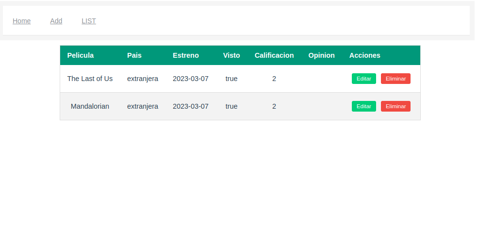

# Peliculas Organizadas

Es una aplicación web para organizar tus películas favoritas.
Construido con Vue, Hasura y GraphQL.

## Project setup
```
npm install
```

## Configuración de Hasura
```
ir a src/main
ingresar URI Hasura y HASURA_ADMIN_SECRET
```

### Compiles and hot-reloads for development
```
npm run serve
```
 

